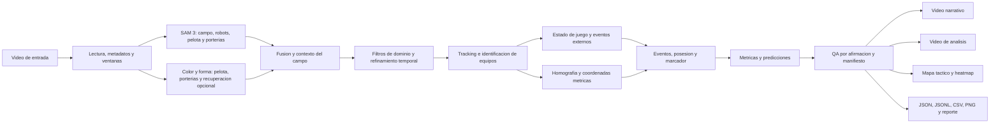

# Pipeline de procesamiento de SAMBA FutBot

**Version:** 1.3.0  
**Equipo:** Pumas  
**Institucion:** Universidad Nacional Autonoma de Mexico (UNAM)  
**Reto:** Copa FutBotMX 2026, Vision por Computadora, categoria Profesional

Este documento describe el flujo reproducible que transforma videos de futbol
robotico en segmentaciones, tracks, coordenadas de cancha, eventos, metricas,
mapas y videos de evidencia. El detector principal es SAM 3. No se usa YOLO ni
Ultralytics.

## 1. Flujo general



La ruta recomendada para camara superior se ejecuta con
`process-top-camera`. `process-video` mantiene una ruta general para otras
vistas. Las dos comparten tracking, estados, eventos, metricas, QA y render.

## 2. Entrada, configuracion y trazabilidad

### Entradas

- Video compatible con OpenCV, normalmente MOV o MP4.
- `config/default.yml`, que versiona modelo, prompts, umbrales, perfiles de
  color, tracking, filtros, analisis y visualizacion.
- Calibracion de cuatro puntos opcional para proyectar pixeles a una cancha de
  `2.43 m x 1.82 m`.
- Anotaciones externas opcionales para intervenciones humanas o incidencias.

Al iniciar, el pipeline obtiene resolucion, FPS, numero de cuadros y duracion.
Los videos largos se dividen en ventanas para limitar memoria de GPU. El
manifiesto de corrida registra argumentos, runtime, artefactos, estado Git y
SHA-256 del codigo y la configuracion utilizados.

## 3. Percepcion con fuentes complementarias

### 3.1 SAM 3 y prompts de contexto

SAM 3 segmenta `field`, `robots`, `ball`, `goal_blue` y `goal_yellow`. Los
prompts se rotan por ventana para aportar variacion semantica sin multiplicar
innecesariamente la inferencia. Incluyen contexto del dominio, por ejemplo
pelota pequena naranja sobre campo verde, pelota en posesion de un robot,
porterias como cajas, postes, tablas o estructuras azules, azul oscuro,
azul-negro y amarillas.

Cada resultado conserva clase, cuadro, caja, score, prompt, fuente y, cuando
esta disponible, ruta e indice de mascara. El score de SAM 3 es confianza del
modelo, no una probabilidad calibrada de que el objeto sea correcto.

### 3.2 Color y forma

La pelota oficial naranja tambien genera candidatos mediante componentes
conexos HSV, area y circularidad. El color es un perfil configurable, no una
dependencia fija: puede cambiarse a blanco, amarillo u otro rango sin modificar
el pipeline.

Las porterias azul y amarilla tienen un respaldo cromatico. Si SAM 3 encuentra
una porteria observada, sus pixeles pueden recalibrar el rango HSV del video.
La seleccion combina confianza, area y cercania a los extremos del eje largo
del campo. Se conserva como maximo una porteria por color y cuadro.

Existe una recuperacion opcional de robots oscuros por color y forma. Esta ruta
esta apagada por defecto y debe superar revision visual y QA antes de mezclarse
con el resultado principal.

## 4. Fusion y restricciones del dominio

Las fuentes SAM 3 y color se fusionan por clase usando IoU, contencion, area,
distancia entre centros y pertenencia al campo. Despues se aplican reglas del
futbol robotico:

- maximo una pelota por cuadro;
- maximo una porteria azul y una amarilla por cuadro;
- pelota sobre el campo o asociada a una mano/intervencion valida;
- descarte de manchas naranjas contenidas en robots;
- robots duplicados eliminados por IoU, contencion, centro, tamano y score;
- proteccion del robot cercano a la pelota para no borrar una interaccion real;
- porterias observadas deben ser compatibles con campo y extremos de cancha.

Si se habilita la propuesta de porteria opuesta, su posicion se obtiene de la
geometria del campo y queda marcada como `geometry_only`. Esa propuesta no se
trata como observacion, no recalibra color y no confirma por si sola un gol.

## 5. Refinamiento temporal y tracking

La pelota se refina seleccionando una trayectoria temporal coherente segun
score, area esperada y salto entre cuadros. Las cajas de porteria pueden usar
una media movil exponencial causal y un limite de salto para reducir parpadeo
sin consultar cuadros futuros.

ByteTrack es el backend recomendado; el tracker IoU queda disponible como
alternativa. El resultado agrega `track_id`, conserva tracks durante ausencias
cortas y evita equiparar una extrapolacion larga con una deteccion observada.

Los robots se clasifican por apariencia en equipo azul, amarillo o `unknown`.
`unknown` se conserva cuando no existe evidencia suficiente. Una auditoria de
calidad mide cobertura, cambios de equipo dentro del mismo track, ambiguedad y
colapso de todos los robots hacia un solo color.

## 6. Estado de juego y eventos externos

Los tracks completos se convierten en estados `in_play`, `dead_ball` y
`human_intervention`. Tambien se registran eventos como pelota ausente, robot
retirado o robot inmovil. Cuando el filtro de juego esta activo, las metricas
deportivas, los eventos y la homografia usan solamente cuadros `in_play`; los
tracks originales nunca se destruyen.

## 7. Homografia, distancias y movimiento

Una homografia validada proyecta anclas de pelota y robots desde pixeles a
metros. Antes de publicar magnitudes metricas se revisan convexidad, orden de
esquinas, cobertura, angulos, relacion de aristas y puntos fuera del frame.

Con calibracion aprobada se calculan:

- posicion y trayectoria de pelota y robots en metros;
- velocidad en m/s;
- distancia de cada robot a la pelota en metros;
- ocupacion, presion y control territorial por zonas;
- entradas a porteria, pelota fuera y robots en areas reglamentarias;
- mapa tactico y mapa de calor acumulado o dinamico.

Sin una homografia aprobada, el sistema conserva unidades `px` y `px/s`. No se
rotulan pixeles como metros.

La prediccion ajusta movimiento reciente y produce ramas de velocidad
constante, giro izquierdo y giro derecho. Los pesos son probabilidades
heuristicas relativas normalizadas, no probabilidades calibradas por un modelo
supervisado. El JSON conserva horizonte, RMSE, velocidad, puntos y alcance.

## 8. Eventos, marcador y posesion

El pipeline produce candidatos de posesion, cambio de posesion, pase,
intercepcion, tiro, colision y gol. La posesion usa proximidad robot-pelota,
continuidad temporal, equipo y estado de juego.

Un gol no se confirma solamente porque la pelota aparezca dentro de una caja de
porteria. La ruta calibrada exige pelota unica y rastreada, cruce dirigido de la
linea, persistencia dentro de la region y, cuando la regla lo requiere,
contacto con la pared trasera. Los eventos que no superan esas condiciones se
conservan como candidatos o rechazados con una causa auditable. El marcador
solo cambia ante `goal_confirmed`.

## 9. Metricas y control de calidad

Las metricas operativas incluyen cobertura por clase, continuidad y
fragmentacion de tracks, saltos de pelota, velocidades, posesion, eventos y
calidad de equipos. La evaluacion del modelo usa COCO AP/AR, AP50, AP75 y
resultados por clase sobre un conjunto separado.

El QA se evalua por afirmacion. Por ejemplo, una corrida puede ser suficiente
para mostrar segmentacion, pero no para defender posesion o velocidad metrica.
El reporte marca cada claim como aprobado, en revision o no sustentado, junto
con la razon. El fine-tuning se compara contra el baseline sobre el mismo
holdout y solo debe promoverse si la mejora relevante compensa sus regresiones.

## 10. Salidas de una corrida

Dentro de `--results-dir` se generan, segun las opciones activadas:

| Carpeta o archivo | Contenido |
|---|---|
| `detections/*.jsonl` | Detecciones separadas por fuente, fusionadas y refinadas. |
| `tracks/*-tracks.jsonl` | Detecciones con IDs, equipo, procedencia y mascaras. |
| `tracks/*-in-play-tracks.jsonl` | Subconjunto usado para analisis deportivo. |
| `events/*-game-state.json` | Estado por cuadro. |
| `events/*-game-segments.json` | Intervalos continuos por estado. |
| `events/*-external-events.json` | Intervenciones e incidencias no deportivas. |
| `events/*-events.json` | Eventos deportivos con evidencia y estado. |
| `events/*-event-summary.json` | Pases, tiros, goles, colisiones y marcador. |
| `metrics/*-metrics.json` | Cobertura, tracking, velocidad, posesion y resumen. |
| `field_analysis/*-field-analysis.json` | Coordenadas metricas, zonas, reglas y predicciones. |
| `field_analysis/*-trajectory.csv` | Trayectoria de pelota en metros. |
| `field_analysis/*-robots.csv` | Posiciones metricas de robots. |
| `field_analysis/*-zone-control.csv` | Control territorial por celda y equipo. |
| `field_analysis/*-field-map.png` | Mapa tactico y heatmap. |
| `videos/*-narrative-demo.mp4` | Narrativa, marcador, posesion y eventos. |
| `videos/*-analysis-demo.mp4` | Cajas, mascaras, IDs, distancias, velocidades y predicciones. |
| `qa/*-qa.json` y `qa/*.md` | Compuertas de calidad y claims defendibles. |
| `reports/*-report.md` | Resumen humano de la corrida. |
| `reports/*-manifest.json` | Comando, hashes, runtime y rutas reproducibles. |

## 11. Ejecucion reproducible

Instalacion del proyecto y SAM 3:

```powershell
python -m venv .venv
.\.venv\Scripts\Activate.ps1
pip install -e ".[dev,viz,sam3]"
pip install -r requirements-sam3.txt
```

Pipeline base para camara superior:

```powershell
python -m samba_futbot.cli process-top-camera `
  --config config/default.yml `
  --video "data\raw\video.mov" `
  --results-dir "outputs\runs\video" `
  --goals `
  --render-narrative `
  --render-analysis `
  --analysis-freeze
```

Pipeline con unidades metricas y mapa tactico:

```powershell
python -m samba_futbot.cli process-top-camera `
  --config config/default.yml `
  --video "data\raw\video.mov" `
  --results-dir "outputs\runs\video_calibrado" `
  --field-calibration "config\calibrations\video.yml" `
  --goals `
  --render-narrative `
  --render-analysis `
  --analysis-freeze
```

En Linux se usa el mismo comando con `/` en las rutas y se activa el entorno
con `source .venv/bin/activate`.

## 12. Lectura correcta de los resultados

1. Revisar primero `reports/*-manifest.json` para confirmar entrada, codigo y
   configuracion.
2. Consultar `qa/*-qa.md` antes de usar una metrica o afirmacion.
3. Diferenciar `observed` de `geometry_only` y `candidate` de `confirmed`.
4. Confirmar que la homografia este aprobada antes de citar metros o m/s.
5. Usar el video narrativo para explicar el partido y el video de analisis para
   inspeccionar evidencia tecnica.
6. Para heatmaps, procesar una duracion representativa o el partido completo;
   un clip de pocos segundos no sustenta comportamiento espacial acumulado.

## 13. Modulos principales

| Modulo | Responsabilidad |
|---|---|
| `sam3_adapter.py` | Integracion con backends oficiales de SAM 3. |
| `windowing.py` | Inferencia por ventanas y rotacion de prompts. |
| `color_ball.py`, `color_goals.py` | Evidencia cromatica y de forma. |
| `windowing.py`, `ball_refinement.py`, `robot_filter.py` | Fusion y restricciones. |
| `tracking.py`, `team.py` | IDs temporales e identificacion de equipos. |
| `play_state.py`, `game_state.py` | Tiempo en juego e incidencias. |
| `calibration.py`, `field_analysis.py` | Homografia, unidades metricas y zonas. |
| `events.py`, `metrics.py` | Eventos, goles y estadisticas. |
| `field_analysis.py`, `motion_prediction.py` | Prediccion de pelota y robots. |
| `heatmap.py`, `field_viz.py`, `visualize.py` | Mapas y videos anotados. |
| `qa.py`, `reporting.py`, `cli.py` | Calidad, reportes y manifiesto reproducible. |
| `cli.py` | Orquestacion de todas las etapas. |

## 14. Alcance

SAMBA FutBot separa explicitamente percepcion, inferencia y confirmacion. Los
resultados visuales son demostraciones del pipeline; la fuente para auditoria
son los JSON/JSONL, calibraciones, reportes QA y manifiestos asociados. Las
limitaciones conocidas se conservan en `docs/RESULTS.md` y no se ocultan en la
edicion del video.
